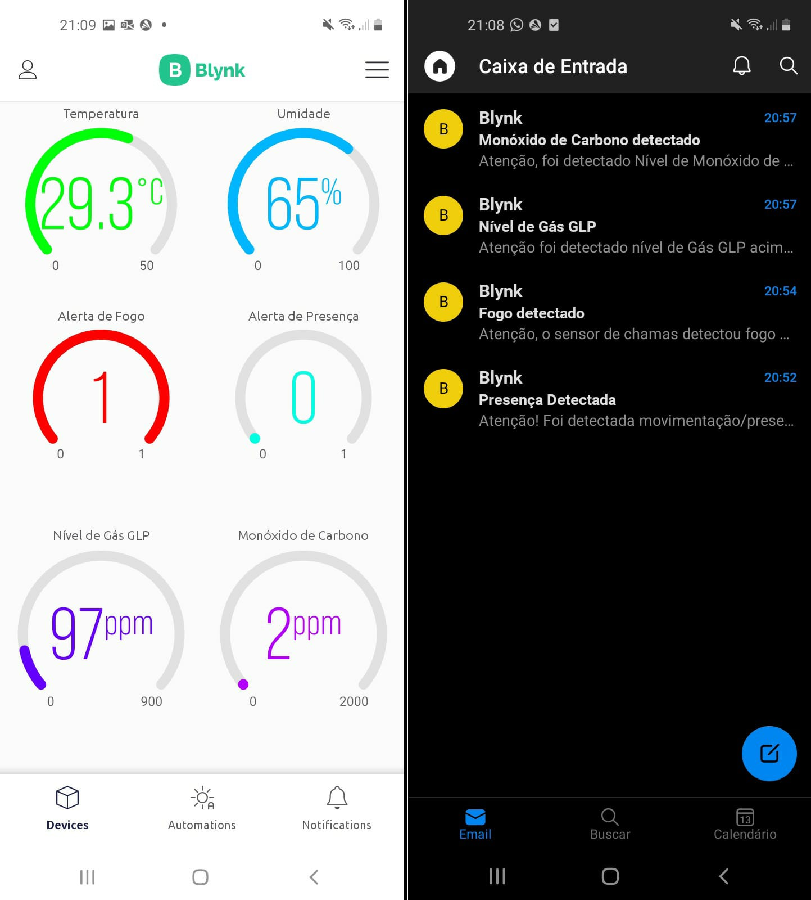

# TCC desenvolvido para Engenharia de Computação UNIVESP 2018.2

## <a  href= "https://www.youtube.com/watch?v=8HujmtjHQLg" target= "_blank">Explicação Protótipo desenvolvido</a>

### Alunos: 

- Daiane Pereira de Moraes Marçal 
- Jeferson Gabriel Alves 
- Jeferson Ricardo Gabriel 
- José Alexandre de Freitas 
- Marcius Ângelo Araújo 
- Willian Marçal da Silva 

Eu Jeferson Gabriel Alves fui responsável por ligação, testes e montagem do protótipo desenvolvido assim como  também por desenvolver código C++ e implementar lógica necessárias para correto funcionamento. Com este arquivo tenho intenção de proporcionar um entendimento de quem for analisar os passos necessários e os materiais e custos  para desenvolvimento da ferramenta IoT.

## Ferramenta Domótica de baixo custo visando monitoramento, segurança e bem-estar residencial 

A constante busca por soluções residenciais abriu caminho para o advento da domótica, por meio de tecnologias que oferecem melhora na segurança e qualidade de vida. O propósito deste Trabalho de Conclusão de Curso foi implementar um sistema eletrônico-digital de monitoramento e automação residencial, com acesso remoto e instantâneo. Metodologicamente, foram empregadas abordagens de pesquisa qualitativa e exploratória, com ampla análise bibliográfica. Estabeleceu-se, como objetivo, desenvolver uma aplicação domótica, de baixo custo aquisitivo, aplicada via Internet das Coisas (IoT), que realiza aferições esporádicas de dados climáticos e ambientais, como temperatura e umidade do ar, além de identificar a existência de gases tóxicos e/ou inflamáveis, fumaça, fogo, ou possível movimentação/presença indevida, na área de instalação. Em qualquer dos citados casos, a aplicação processa os dados obtidos pelos sensores e alerta o proprietário, imediatamente, via sinal sonoro e notificação em aplicativo móvel disponibilizado para smartfones ou tablets, nos sistemas operacionais Android e iOS. Os resultados indicam que esta ferramenta será útil ao usuário final, uma vez que promove automação, segurança e comodidade em seu lar, por meio de monitoramento remoto e em tempo real, com reduzido custo de implementação. 

#### Arquitetura estrutural do protótipo

### Orçamento e custos do Projeto

| **Componentes Eletrônicos utilizados/materiais utilizados** | **Quantidade** | **Valor de Mercado** |
| ----------------------------------------------------------- | -------------- | -------------------- |
| Microcontrolador (NodeMCU ESP8266)                          | 01             | R$ 34,33             |
| Sensor de Gás Inflamável e Fumaça (MQ-2)                    | 01             | R$ 6,67              |
| Sensor de Monóxido de Carbono (MQ-7)                        | 01             | R$ 6,11              |
| Sensor de Temperatura e Umidade (DHT11)                     | 01             | R$ 9,37              |
| Detector Infravermelho de Chamas (LM393)                    | 01             | R$ 3,58              |
| Detector de Movimento (PIR HC-SR501)                        | 01             | R$ 4,46              |
| Módulo Multiplexador (CD74HC4067)                           | 01             | R$ 2,76              |
| Placa de Desenvolvimento (Protoboard)                       | 02             | R$ 9,88              |
| Led na cor vermelha                                         | 01             | R$ 0,17              |
| Resistores de 330 Ω                                         | 02             | R$ 0,25              |
| Buzzer (alarme)                                             | 01             | R$ 3,25              |
| Carregador micro USB                                        | 01             | R$ 4,99              |
| Caixa acrílica tamanho G                                    | 01             | R$ 27,24             |
| **TOTAL**                                                   | **R$ 113,06**  |                      |

 

### Preparação do Ambiente de desenvolvimento

Para dar andamento na implementação do protótipo, primeiramente, foi realizada a preparação do ambiente de desenvolvimento, mais precisamente do Arduino IDE, a fim de possibilitar a programação do módulo NodeMCU ESP8266 e dos demais componentes eletrônicos. O primeiro passo foi adicionar o URL (endereço) que contém as informações básicas de configuração do citado microcontrolador. Para tanto, no Arduino IDE, basta acessar o menu Arquivo > Preferências e ir em “URLs Adicionais para Gerenciadores de Placas”. O endereço a ser inserido é *http://arduino.esp8266.com/stable/package_esp8266com_index.json*. 

Foi fundamental instalar, também, no IDE do Arduino, o pacote de informações e compatibilidade da placa NodeMCU ESP8266, acessando o menu Ferramentas > Placas > Gerenciador de Placas e, no campo de texto, digitar “ESP8266”. Nesse momento, será apresentado o pacote “by ESP8266 Community”, que deverá ser instalado para o correto funcionamento do dispositivo.

Para a devida compilação e transferência dos códigos de programação para o NodeMCU, foi necessário instalar, ainda, o driver de fábrica desse componente, denominado *CH340G*, disponibilizado pelo fabricante, para reconhecimento e gerenciamento da porta de comunicação (COM), ao conectar o módulo no computador, via cabo usb. Além disso, foram adicionadas algumas bibliotecas essenciais na compilação do código, a ser desenvolvido, tais como: 

*ESP8266WiFi.h*: Necessário para o devido funcionamento do microcontrolador, provendo diversas funções na conexão da rede sem fio; 

*DHT.h*: Responsável pelo funcionamento do sensor de umidade e temperatura DHT11; 

*BlynkSimpleEsp8266.h:* Biblioteca para intercomunicação entre o módulo NodeMCU ESP8266 e a Plataforma IoT Blynk. 

### Construção e implementação do sistema

#### Layout circuito

)

## Programação

Com todos os dispositivos conectados e energizados, iniciou-se a programação junto ao IDE do Arduino. Toda a codificação final do protótipo pode ser averiguada junto ao APÊNDICE A, deste trabalho. No código implementado, inicialmente, definiu-se alguns parâmetros necessários do Blynk, como *ID* do modelo, nome do dispositivo, *auth token* (identificador) de autenticação e a versão do *firmware*. Comandos como *char auth[]*, *const char\* ssid = ""* e *const char\* password = ""* definem o *token* de autenticação do Blynk e as informações da rede wifi, especificando o nome da rede e a senha. Em seguida, foram gerados os comandos *#define DHTPIN 12* que controlam o pino digital *D6* (*GPIO5*), conectado ao sensor DHT11. 

Foram criadas variáveis para os sensores de gases (MQ-2 e MQ-7), de chamas (LM393) e para o buzzer, definidas como *sensor0mq2*, *sensor1mq7, sensorchama* e *buzzer*. Um detalhe importante é o fato que ambos os sensores MQ-2 e MQ-7 possuem apenas saída analógica, enquanto o módulo NodeMCU detém somente uma porta de entrada analógica. Após estudos e testes, a solução cabível foi utilizar o multiplexador analógico/digital CD74HC4067, que permite expandir a quantidade dessas portas junto ao microcontrolador. 

Definiu-se o pino digital *D5* (*GPIOS*), conectado ao sensor de presença (HC-SR501), com a linha de comando *#define pinPIR 14*. As linhas *#define S0 D0*, *#define S1 D1*, *#define S2 D2* e *#define S3 D3* referenciam os pinos utilizados pelo multiplexador (CD74HC4067), além da sentença *#define smokeA0 A0* que define o pino analógico *A0*, conectado ao pino de sinal do multiplexador. A linha *#define LED D8* define o pino em que foi conectado o led vermelho. 

No *void setup()* foi utilizado o comando *pinMode* onde se define um pino específico como entrada ou saída, e neste caso, os pinos dos atuadores (buzzer e led) como *OUTPUT* (saída), e o pinos dos sensores de chama e de presença como *INPUT* (entrada). Na função *void setup()* também foi implementado um laço *while* para verificação da conexão wifi. 

Em seguida, foi codificado o *void loop()*, onde criou-se uma variável nomeada como *valorPIR,* do tipo *bool* que herda a função *digitalRead*, comumente utilizada na leitura de um pino específico, neste caso o pino *D5* do sensor de movimento. Além disso, inseriu-se comandos para exibição dos dados aferidos pelo sensor, e uma lógica *if* (condição) onde foi programado: se o valor *valorPIR* detectar com nível alto “HIGH”, então aciona-se o buzzer, acende o led vermelho e notifica o usuário. Tem-se também a linha de comando *Blynk.virtualWrite(V0, valorPIR)*, usado pela Plataforma Blynk para ler os dados captados pelos sensores. 

Para o sensor infravermelho de chamas (LM393), criou-se uma variável com o nome *digitalsensor* do tipo *int*, que utiliza a função *digitalRead* para ler e verificar dados de um pino digital, no caso o pino *D7* do NodeMCU, onde está conectado o sensor. Por fim, foi implementada uma lógica *If/Else* em que: caso o sensor de chamas detectar o valor booleano “0”, significa a presença de fogo no ambiente, imediatamente acionando o alerta sonoro (buzzer) e led, além de notificar o usuário via *app* Blynk. 

Ainda no *void loop()*, foi realizada a configuração do sensor DHT11, onde usou-se os comandos *float umidade = dht.readHumidity()* e *float temperatura = dht.readTemperature* para leitura de umidade e temperatura, respectivamente. Foi utilizado o comando *Blynk.virtualWrite* para definição dos pinos virtuais usados pela Plataforma IoT Blynk, onde definiu-se *V5* para umidade e *V6* para temperatura. 

Na sequência, foram inseridas duas novas funções para controle e correto funcionamento dos sensores MQ-2 e MQ-7. Para o MQ-2, foi implementada a função *void getSensor0mq2(),* que recebe os dados captados pelo sensor, por meio da função *analogRead(smokeA0)*, lendo um valor analógico a partir do pino conectado. Antes da leitura, é definida qual saída do multiplexador será utilizada para o sensor, por meio dos comandos *digitalWrite(S0, LOW)*, *digitalWrite(S1, LOW),* *digitalWrite(S2, LOW)* e *digitalWrite(S3, LOW)*. 

O valor auferido pelo sensor MQ-2 é transmitido para o aplicativo Blynk, mediante o comando *Blynk.virtualWrite(V2, sensor0mq2)*. Além disso, há uma lógica *if* que verifica se os dados são maiores que uma grandeza crítica pré-definida (400 ppm) pela variável *sensorGLP*, e, caso positivo, o protótipo aciona imediatamente o alerta (buzzer) e acende o led vermelho, além de notificar o usuário via *app* Blynk. 

Implementou-se, também, a função *getSensor1mq7()*, responsável pela leitura dos dados do sensor de gás (MQ-7), conectado ao pino *smokeA0*. O multiplexador é utilizado para selecionar qual sensor será lido, e neste caso, o canal 1 (*C1 pin*) é escolhido com a configuração dos pinos *S0*, *S1*, *S2* e *S3* do multiplexador. A função *analogRead()* é utilizada para obter os dados do sensor, que são armazenados na variável *sensor1mq7*, para posterior envio ao aplicativo Blynk, por meio da função *Blynk.virtualWrite()*. Por fim, é feita uma comparação entre o valor lido pelo sensor e a grandeza limite de referência (15 ppm). 

Verificou-se efetivo funcionamento do protótipo, e partiu-se para o desenvolvimento do aplicativo *mobile*. Para tanto, na plataforma IoT Blynk, foi criada um *device* (dispositivo) denominado “Monitoramento Residencial”. Com o intuito de proporcionar comunicação entre o *hardware* e a o Blynk, é necessário estabelecer, pelo *app*, um identificador (*Auth Token*) a ser fornecido para o código de programação no Arduino IDE. 

A plataforma Blynk possui uma variada lista de *widgets* (elemento de interação), onde o programador seleciona a que desejar e adiciona na *dashboard* (interface visual) de desenvolvimento, para sua devida configuração e implementação. Em seguida, criou-se diversos *datastreams* (fluxo de dados), especificamente um para cada sensor eletrônico, que servirão como ponte de acesso entre servidor e os dados auferidos pelo *hardware* do circuito. 

Para cada *widget* adicionado, é necessário configurar seus parâmetros, tais como os *datastreams* utilizados para associação dos pinos, o tipo de dado lido, além de sua interface gráfica, vinculando, ainda, um pino virtual (*Pin Index*) para cada sensor inserido. Os pinos selecionados foram: Gases Inflamáveis/Fumaça (*V2*); Monóxido de Carbono (*V1*); Temperatura (*V6*); Umidade (*V5*); Fogo/Chamas (*V7*) e Detector de Movimento/Presença (*V0*). 

### Fluxo de dados/ Automations

Foi necessário, ainda, implementar *automations* (automações), a fim de notificar o usuário, ou o proprietário da residência, caso algum dos sensores detecte algo previamente estabelecido e programado junto ao microcontrolador. Para tanto, tais *automations* foram configuradas para serem acionadas nos respectivos casos: o nível de gases inflamáveis ou fumaça, lido pelo sensor MQ-2, for maior que 400 *ppm*; o nível de gás monóxido de carbono (CO), auferido pelo sensor MQ-7, for maior que 15 *ppm*; o detector infravermelho de chamas (LM393) apontar o valor booleano “0” (significa que identificou chamas/fogo); ou o detector de presença/movimento (PIR HC-SR501) apontar nível alto “HIGH”. Em todos os citados casos, a aplicação domótica desenvolvida irá, imediatamente, alertar o usuário final, por meio de notificação via celular ou tablet, além de acionar o sinal sonoro (buzzer) e led vermelho. 

## Resultados

#### Protótipo final em funcionamento

#### Monóxido de carbono/ Gás inflamável

Notificações recebidas pelo app Blynk

#### Presença detectada/ fogo detectado

Notificações recebidas pelo app blynk

 

#### Tela principal App Blynk e notificações de alerta por email

Para a execução dos testes de operação, foram utilizados gás de cozinha (GLP), isqueiro e fumaça, para verificação dos sensores MQ-2 e de chamas (LM393). Para captar monóxido de carbono (CO), pelo sensor MQ-7, moveu-se o protótipo próximo a uma motocicleta com motor em funcionamento. E por último, para captar movimento/presença indevida, pelo detector PIR HC-SR501, foi necessário apenas um dos autores se locomover próximo ao ambiente de instalação. Com isto, foi possível notar que a ferramenta domótica desenvolvida atingiu os resultados esperados e o adequado funcionamento do sistema de monitoramento inteligente e automação, com reduzido custo econômico, tornando-a passível de implementação para famílias com menor poder aquisitivo. 

## Considerações

Ainda que a automação residencial, conhecida como domótica, apresente constantes avanços, e seja alvo de estudos e grande interesse devido às suas muitas vantagens, o seu elevado custo de aquisição e implantação ainda é um fator que, muitas vezes, desestimula ou inviabiliza sua aplicação, para grande parte da população menos favorecida financeiramente. Perante a isto, propôs-se o desenvolvimento de uma acessível ferramenta domótica de controle, monitoramento e segurança, gerando comodidade, conforto e bem estar ao indivíduo, em ambientes residenciais. 

Com relação aos objetivos apresentados no capítulo 2 deste trabalho, os mesmos foram alcançados, por meio da implementação de um protótipo eletrônico-digital, utilizando um microcontrolador NodeMCU ESP8266, em conjunto com diversos sensores, tais como MQ-2, MQ-7, DHT11, LM393 e PIR HC-SR501, dos atuadores BUZZER e LED, além da linguagem de programação C++, do IDE do Arduino e da Plataforma IoT Blynk. 

Após diversos testes, constatou-se que o sistema domótico desenvolvido é funcional e promissor, ressaltando a grande vantagem de possuir reduzido custo de aquisição, que no caso foi de R$ 113,06 (valor este sem levar em consideração a mão-de-obra), tornando-a acessível não somente a residências de alto padrão. 

Por fim, é oportuno recomendar que futuros projetos abordem uma ampliação deste protótipo tecnológico, agregando possíveis novas funcionalidades, como acoplar uma câmera de monitoramento, ou um sistema de gerenciamento e controle de temperatura, em que, caso constatado um possível incêndio, fumaça ou temperatura demasiadamente elevada, a ferramenta acione, automaticamente, ventiladores, aparelhos de ar condicionado, ou, até mesmo, sistema de *sprinkler* (conjunto de pequenos chuveiros hidráulicos interligados a um sistema de bombeamento de água), ampliando assim o nível de segurança e automação na residência. 

Destaca-se, ainda, que devido ao curto espaço de tempo disponível para a elaboração e desenvolvimento deste Trabalho de Conclusão de Curso, não foi possível integrar todos os componentes eletrônicos utilizados, junto à uma única Placa de Circuito Impresso – PCI (do inglês, *Printed Circuit Board* – PCB), com o intuito de tornar a ferramenta domótica mais compacta e portátil, ao usuário final, então sugere-se, também, que trabalhos futuros contemplem esse conceito de melhoria. 
